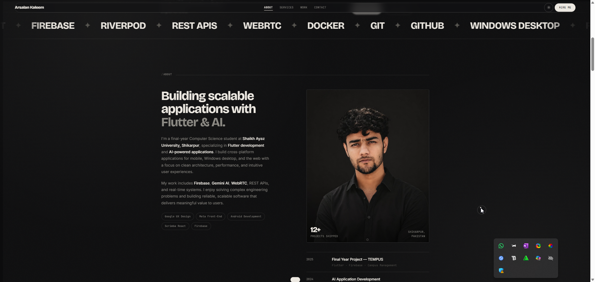

<!--
  ╔══════════════════════════════════════════════════════════════╗
  ║  Before publishing, replace every <PLACEHOLDER> below:        ║
  ║    <USERNAME>   → your GitHub username (e.g. arsalankaleem)    ║
  ║    <REPO>       → your repo name      (e.g. portfolio)        ║
  ║    <LIVE_URL>   → your deployed site  (e.g. arsalan.dev)      ║
  ║    <EMAIL>      → your contact email                          ║
  ║  Then add a screenshot at  ./assets/preview.png               ║
  ╚══════════════════════════════════════════════════════════════╝
-->

<h1 align="center">Arsalan Kaleem — Portfolio</h1>

<p align="center">
  <em>A cinematic, single-file developer portfolio.</em><br>
  Monochrome editorial design · GSAP scroll storytelling · light/dark mode · zero build step.
</p>

<!-- ─── TECH BADGES ─────────────────────────────────────────── -->
<p align="center">
  
  
  
  
  
</p>

<!-- ─── REPO BADGES (need <USERNAME>/<REPO>) ────────────────── -->
<p align="center">
  /<REPO>?style=flat-square" alt="License">
  /<REPO>?style=flat-square" alt="Stars">
  /<REPO>?style=flat-square" alt="Forks">
  /<REPO>?style=flat-square" alt="Last commit">
  /<REPO>?style=flat-square" alt="Repo size">
  
</p>

<p align="center">
  <a href="https://<LIVE_URL>"><strong>🌐 Live Demo</strong></a>
  ·
  <a href="#-customization"><strong>🎨 Customize</strong></a>
  ·
  <a href="#-deployment"><strong>🚀 Deploy</strong></a>
</p>

<!-- Add a screenshot here once you have one -->
<p align="center">
  
</p>

---

## ✦ Overview

A premium, Awwwards-leaning personal portfolio for **Arsalan Kaleem**, a Flutter &amp; AI developer.
The whole site lives in **one self-contained HTML file** — no framework, no bundler, no install.
Open it in a browser and it just runs; the animation libraries are vendored inline, so it works
offline and never breaks from a CDN change.

The design language is deliberately restrained: a warm monochrome, oversized grotesque
typography, mono slash-labels, and editorial spacing. The motion is layered on top to amplify
that restraint rather than fight it.

---

## ✨ Features

- **🎬 Cinematic preloader** — logo mark → 0–100 counter → curtain wipe → name revealed character
  by character with `SplitText`. Click anywhere to skip.
- **🖱️ Custom magnetic cursor** — dot + ring with contextual labels (`VIEW` / `OPEN` / `VISIT` /
  `SEND`), grows over media, snaps to buttons. Auto-disabled on touch devices.
- **📜 Scroll storytelling** — hero scales into depth, statements reveal word-by-word, stats count
  up, the portrait reacts to the mouse, section lines draw themselves in.
- **🪟 Sticky project showcase** — projects stack and push each other away Apple-style, each with a
  3D-tilting phone mockup and its own ambient tint.
- **🌗 Light / Dark mode** — true token swap (not a filter), with **system-preference detection**,
  **`localStorage` persistence**, and a smooth crossfade on switch.
- **🖼️ Theme-aware portrait** — a separate photo for light and dark, cross-fading with the theme.
- **📱 Fully responsive** — fluid `clamp()` type, a compact mobile layout, and a full-screen mobile
  menu with a clear close (✕) control.
- **♿ Accessible** — honours `prefers-reduced-motion`, semantic HTML, visible focus states, a skip
  link, and ARIA labelling.
- **⚡ Performant** — GPU-friendly transforms only, libraries vendored (no render-blocking CDN),
  one file to cache.
- **🥚 Easter eggs** — a few hidden rewards for the curious (see below).

---

## 🛠️ Tech Stack

| Layer        | Tools |
|--------------|-------|
| Markup       | Semantic **HTML5** (single file) |
| Styling      | **CSS3** — custom-property design tokens, fluid `clamp()` type, Grid &amp; Flexbox |
| Behaviour    | **Vanilla JavaScript** (no framework) |
| Animation    | **GSAP 3.13** · **ScrollTrigger** · **SplitText** |
| Smooth scroll| **Lenis** |
| Typography   | Bricolage Grotesque · Inter · JetBrains Mono (Google Fonts) |

> All animation libraries are **inlined** into the HTML, so the published file has **no external
> JS dependencies**.

---

## 🥚 Easter Eggs

| Trigger | What happens |
|---------|--------------|
| Press **`G`** | Toggles a 12-column design-grid overlay |
| Click the **logo** 5× | Unlocks and cycles a hidden accent colour |
| Click the pulsing **“available” dot** | A little hello |
| **`↑ ↑ ↓ ↓ ← → ← → B A`** | The Konami surprise |
| Click during the **loader** | Skips the intro instantly |

---

## 🚀 Getting Started

This is a static site — there is genuinely nothing to install.

```bash
# 1. Clone
git clone https://github.com/<USERNAME>/<REPO>.git
cd <REPO>

# 2. Open it
#    macOS:
open arsalan-portfolio.html
#    Windows:
start arsalan-portfolio.html
#    Linux:
xdg-open arsalan-portfolio.html
```

Prefer a local server (recommended, so fonts and routing behave exactly like production)?

```bash
# Python 3
python3 -m http.server 8000
# then visit http://localhost:8000/arsalan-portfolio.html

# …or Node
npx serve
```

---

## 📁 Project Structure

```
.
├── arsalan-portfolio.html   # the entire site (HTML + CSS + JS + vendored libs)
├── assets/
│   └── preview.png          # social/README screenshot (add your own)
├── README.md
├── LICENSE
├── CHANGELOG.md
└── .gitignore
```

> The portrait photos are hosted externally (Cloudinary) and referenced by URL, which keeps the
> repo light. Swap the `src` of the two `.portrait-img` tags to use your own.

---

## 🎨 Customization

Everything you'd want to change lives either in the `<style>` block at the top or in the readable
`<script>` at the very bottom. **Don't touch the four dense minified `<script>` blocks near the end
— those are the vendored GSAP / Lenis libraries.**

| I want to change… | Where to look |
|-------------------|---------------|
| **Colours / theme** | `:root { }` (dark palette) and `html.light { }` (light palette). Edit `--ink` (background) and `--bone` (text). |
| **Fonts** | The Google Fonts `<link>` in `<head>`, plus `--font-display / --font-body / --font-mono`. |
| **Name, bio, copy** | Directly in the HTML sections — just type over the text. |
| **Rotating role text** | The `roles` array in the script. |
| **Marquee words** | The `.marquee-item` spans (duplicated once for a seamless loop — edit both copies). |
| **Projects** | The three `<article class="panel">` blocks and the three `.mini` cards. |
| **Portrait photos** | The two `.portrait-img` `src` URLs (one for dark, one for light). |
| **Footer watermark size** | `.foot-word { font-size: clamp(4rem, 26vw, 22rem) }` — the middle `vw` is the live value. |
| **Easter-egg accent colours** | The `accents` array in the script. |

### Replace the placeholder links

Before going live, update these (search the file for `#` and `example.com`):

- Social links — `mailto:` email, GitHub, LinkedIn, and the résumé link
- Each project's **View project** and **GitHub** buttons
- The `<title>`, `<meta name="description">`, and `og:` tags in `<head>`

### Hook up the contact form

The form currently shows a **visual success state only** — it doesn't send anything yet. Point it at
a no-backend service like [Formspree](https://formspree.io) or [Web3Forms](https://web3forms.com)
to start receiving messages.

---

## 🌐 Deployment

Because it's a single static file, it deploys anywhere in seconds.

<details>
<summary><strong>GitHub Pages</strong></summary>

1. Push to `main`.
2. **Settings → Pages → Build and deployment → Source: Deploy from a branch**.
3. Choose `main` / `root` and save.
4. (Optional) Rename `arsalan-portfolio.html` to **`index.html`** so the site loads at the root URL.

</details>

<details>
<summary><strong>Netlify</strong></summary>

Drag-and-drop the file onto [app.netlify.com/drop](https://app.netlify.com/drop), or connect the
repo — no build command, publish directory `/`.

</details>

<details>
<summary><strong>Vercel</strong></summary>

`vercel` from the project root, or import the repo in the dashboard. Framework preset: **Other**,
no build step.

</details>

---

## ♿ Accessibility &amp; Performance

- Respects `prefers-reduced-motion` — the loader skips instantly and all content stays visible.
- Semantic landmarks, a skip-to-content link, visible `:focus-visible` rings, and ARIA labels.
- Animations are limited to `transform` / `opacity` for smooth 60 fps.
- No render-blocking third-party scripts; libraries are inlined and the page is one cache hit.

---

## 🧩 Featured Projects (in the portfolio)

| Project | What it is | Stack |
|---------|------------|-------|
| **CareerGPT** | AI career assistant — resume scoring, ATS-optimised CV generation, interview coaching, PDF export, streaming responses. | Flutter · Gemini AI · Riverpod · Firebase |
| **Simul** | Social watch-party platform — YouTube sync, WebRTC voice/screen share, Connect-4 mini-game. | Flutter · LiveKit · WebRTC · Firebase |
| **CivicPing** | Citizen infrastructure-reporting platform mapping public issues across Pakistan. | Flutter · Firebase · Maps API |
| **SAUSSync** | Cross-platform academic schedule management for university use. | Flutter · Firebase · Windows |
| **UniTime** | Constraint-satisfaction timetable generator with conflict resolution. | Flutter · CSP solver |
| **MilBus** | Research platform mapping Pakistan's military-linked business ecosystem. | Research · Data viz |

---

## 🗺️ Roadmap

- [ ] Wire the contact form to a real endpoint
- [ ] Add live project links &amp; GitHub repos
- [ ] Add a downloadable résumé
- [ ] Lighthouse pass &amp; Open Graph image
- [ ] Optional case-study pages

---

## 📬 Contact

**Arsalan Kaleem** — Flutter &amp; AI Developer · Shikarpur, Pakistan

- 🌐 Website — `https://<LIVE_URL>`
- ✉️ Email — `<EMAIL>`
- 💼 LinkedIn — `https://linkedin.com/in/<USERNAME>`
- 🐙 GitHub — `https://github.com/<USERNAME>`

---

## 📄 License

Distributed under the **MIT License**. See [`LICENSE`](./LICENSE) for details.

> The **design, code, and structure** are MIT-licensed. The **personal content** (name, bio,
> photos, and project write-ups) remains © Arsalan Kaleem — please swap it for your own if you
> reuse this as a template.

---

## 🙏 Acknowledgements

- [GSAP](https://gsap.com) — GreenSock Animation Platform (incl. ScrollTrigger &amp; SplitText)
- [Lenis](https://lenis.darkroom.engineering) — smooth scroll by Darkroom Engineering
- [Bricolage Grotesque](https://fonts.google.com/specimen/Bricolage+Grotesque),
  [Inter](https://fonts.google.com/specimen/Inter),
  [JetBrains Mono](https://fonts.google.com/specimen/JetBrains+Mono)

<p align="center"><sub>Designed &amp; built by Arsalan Kaleem — deliberately.</sub></p>
